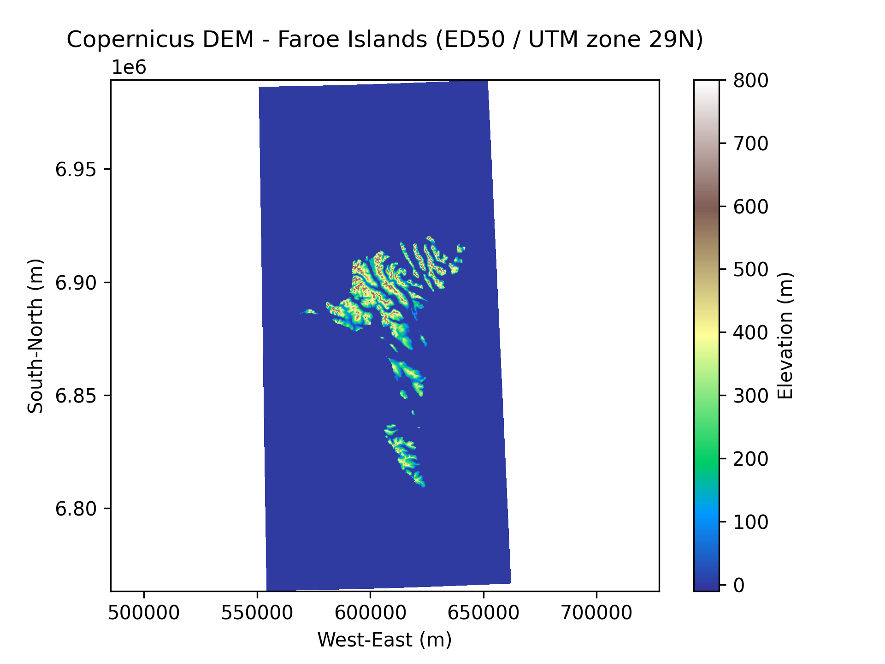
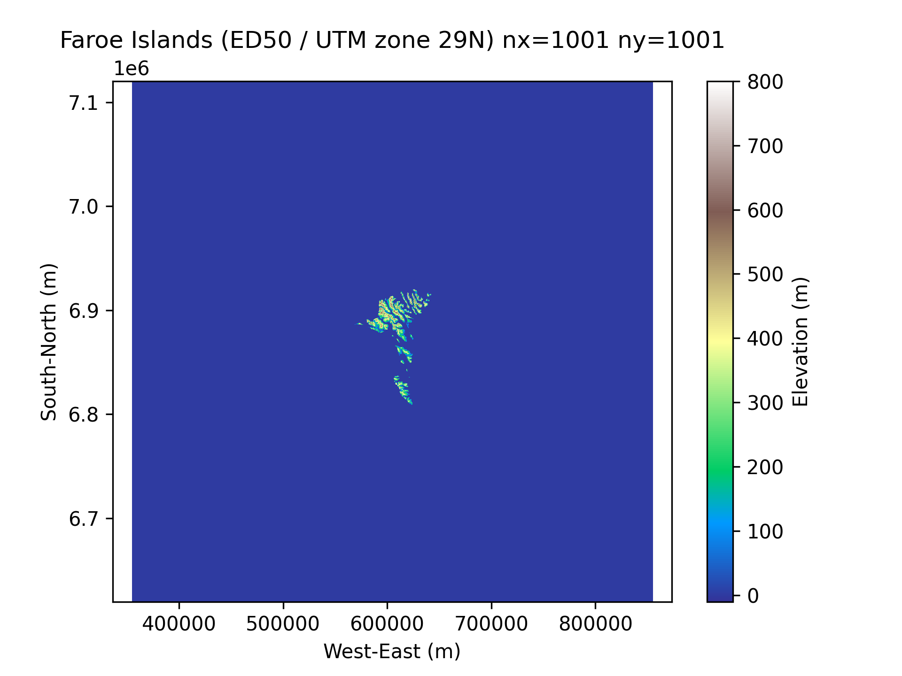

# PMAP LES simulation of the Eowyn storm around Faroe Islands 2025/01/24

### 1. Download Copernicus digital elevation model (DEM)

Start by downloading the Copernicus DEM tiles covering Faroe Islands:

```
./copernicus_dem_faroe_download.sh  
```

The scripts creates and downloads the `TIF` files to `data/copernicus_dem_faroe/`. Positions of the cells in the DEM tiles are given in `ED50 / UTM zone 29N (EPSG:23029)` coordinates, see [https://epsg.io/23029](https://epsg.io/23029).


Plot the tiles to check that they are downloaded alright:

```
uv run copernicus_dem_faroe_plot.py      
```

The plot should look like this:



### 2. Extract and save orography to a netcdf file 

Now interpolate the elevation to the pmap grid and save to netcdf. The configuration of the interpolation is in `config/config.yml`, where the interpolation parameters are:

- `x0,y0`: Domain center in ED50 / UTM zone 29N (EPSG:23029) coordinates.
- `Lx,Ly`: Domain side lengths in ED50 / UTM zone 29N (EPSG:23029) coordinates.
- `nx,ny`: Number of points in x and y directions.

```
uv run copernicus_dem_faroe_to_pmap.py  
```
It saves the netcdf file and a png of the domain to e.g. `data/pmap_les_orography_faroe/faroe_dem_500000x500000_1001x1001.nc` and `data/pmap_les_orography_faroe/faroe_dem_500000x500000_1001x1001.png`: 




### 3. Running PMAP for the Eowyn 2025/01/24 storm around Faroe Island 

Now the orography data has been prepared we can start running pmap.

Assuming the pmap is installed in the folder `$PMAP_DIR` e.g.:
```
export PMAP_DIR=/users/olindber/PMAP-LES-shared
```

and this repository has been checked out to `$PMAP_FAROE_EOWYN` e.g.:

```
export PMAP_FAROE_EOWYN=/projappl/project_465000527/olindber/data/pmap-les/pmap-les_faroe-eowyen-20250124
```

go to `$PMAP_FAROE_EOWYN`:

```
cd $PMAP_FAROE_EOWYN
```

and run all the cases:

```
./pmap_run_all.sh $PMAP_FAROE_EOWYN $PMAP_DIR
```

PMAP 2025-01-24 Eowyn storm setup

Setting limits and spatial subdivision for the physical bounding box. 

Reading in the topography from the netcdf file

Setting constant wind boundary conditions

Running

Movie


faroe_eowyn_20250124_plot.py  
faroe_eowyn_20250124_animate.py  
geotiff_dem.py                
